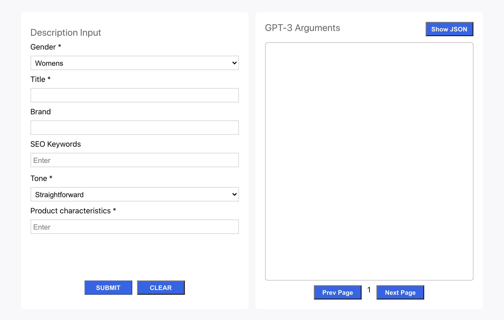
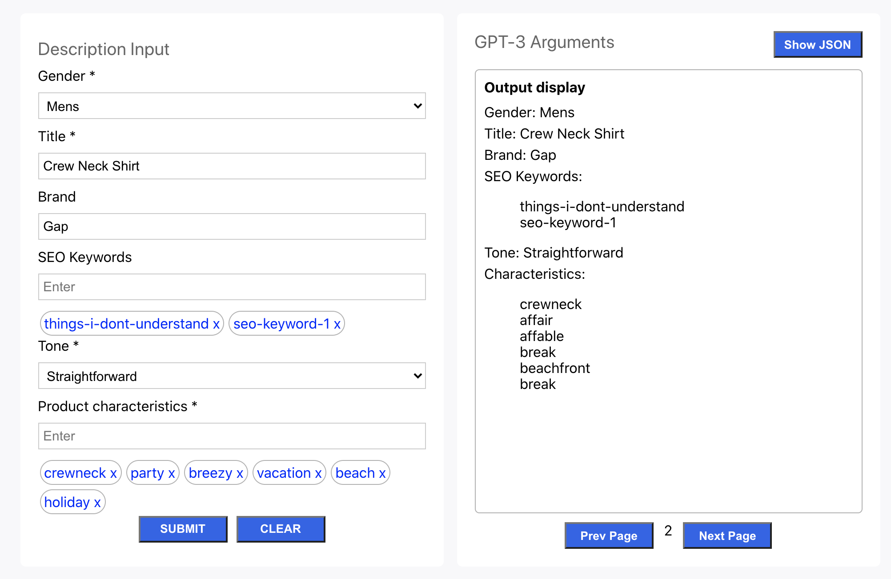

## perci test form

Thought it might be useful to have several options per generation, and a way I thought to do that with your call to gpt-3, was to use synonyms. Here is a proof of concept.

## Basic

just a mock up of your input form



when submitted, there is an api call to meriam-webster's thesaurus, and from there three options are curated from the api's response, and turned into additional GPT-3 calls. There are 4 potential GPT-3 calls: the original and three new versions with synonyms. If there are no synonyms, the original word is plugged in. There is some whackiness of course.




## Production

Made using React

You can download the application and run it locally:

```
$ git clone https://github.com/lennox-davidlevy/perci_form.git
$ cd perci_form
$ npm install
```

You need to create a .env file in the root

```
$ touch .env
```

then add this line to .env

```
REACT_APP_THESAURUS_API=<api key for meriam-webster collegiate thesaurus>
```

You will have to go https://dictionaryapi.com/ and sign up for an API key for the collegiate thesaurus, and plug that api key into the .env file

Then just make sure you're in the your root, run

```
$ npm run dev
```

if you cannot run npm

```
$ brew update
$ brew install node
```

Thats all. Hope you can find some use with this. It was a good practice for me, so even if it is totally useless (good chance lol), I had fun making it.
